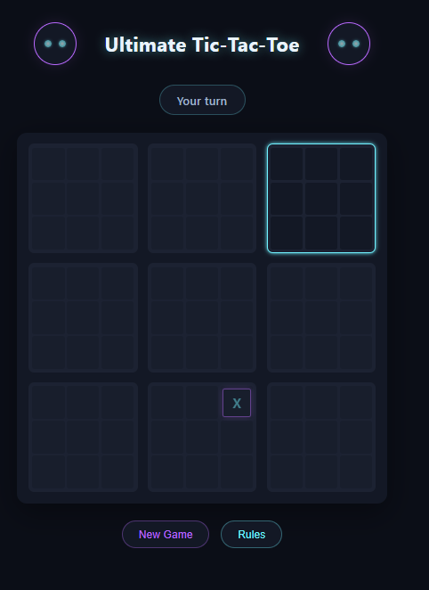

# Super Tic-Tac-Toe

An Ultimate Tic-Tac-Toe AI, trained from scratch through self-play, that you can play against right in your browser. Built for the Stardance challenge.



## Play it

**[raczjonathan12.github.io/super-tic-tac-toe](https://raczjonathan12.github.io/super-tic-tac-toe/)**

No install, no login. The trained model runs entirely in your browser with TensorFlow.js.

## Quick start (training pipeline)

```bash
python -m venv .venv && .venv/Scripts/activate   # or source .venv/bin/activate on Mac/Linux
pip install -r requirements.txt
python train.py
```

`train.py` resumes automatically from `final_model.keras` if one already exists, so you can stop and restart it without losing progress.

## Features

**Training pipeline (Python)**
- Full Ultimate Tic-Tac-Toe rules engine: 9 sub-boards, forced-move routing (your move sends your opponent to the matching sub-board), sub-board wins, and meta-board wins
- A policy/value neural network (`network.py`) that scores board positions and suggests moves
- Monte Carlo Tree Search (MCTS) guided by that network, AlphaZero-style, for real tactical lookahead instead of relying on the network alone
- Three MCTS variants: one game at a time, many games batched together (used during training), and a single game with batched lookahead (`run_mcts_leaf_parallel`, built for the browser deployment)
- Self-play data generation, a supervised training step, and an evaluation harness that plays the current model against a random player, a simple heuristic player, or an earlier checkpoint
- Checkpointing that saves the model, the replay buffer, and the current iteration number, so a training run can be killed and resumed without starting over
- A test suite covering the rules engine, the network, all three MCTS variants, self-play, and the training loop

**Browser app (`docs/`)**
- Plain HTML, CSS, and JavaScript, no build step or framework
- The rules engine and the leaf-parallel MCTS search ported to JavaScript, so the browser opponent does the same real tree search as the Python version, not just a raw network guess
- The trained model converted to TensorFlow.js and run client-side, no server involved
- Legal sub-boards glow so you always know where you're allowed to play
- A rules popup, a New Game button, and a small human/robot mascot whose eyes react to whose turn it is

## Local setup

- Python 3.13
- Install dependencies: `pip install -r requirements.txt` (installs `tensorflow`, `numpy`, `pytest`, and `tensorflowjs`)
- Run the test suite: `python -m pytest tests/ -v` (run from the repo root, tests import top-level modules like `game.py` directly)
- Run one test file: `python -m pytest tests/test_mcts.py -v`
- Train: `python train.py`. This runs the full self-play -> train -> checkpoint -> evaluate loop and writes checkpoints to `checkpoints/`

To run the browser app locally instead of training:

```bash
python -m http.server 8000 --directory docs
```

Then open `http://localhost:8000/` in a browser.

## How it works

The first version of this project used a DQN (deep Q-network) trained through self-play. It never learned real tactics, it kept converging to a policy that barely reacted to the actual board. MCTS was adopted instead because it uses genuine tree search: forced wins and forced blocks get found by the search itself, not inferred from the network's judgment. That distinction matters enough that the test suite specifically checks these tactics get found even with a freshly initialized, untrained network, since real search (not the network) is what's supposed to find them.

For the browser deployment, the interesting problem was speed. During training, MCTS batches its network calls across many simultaneous self-play games, which is fast but doesn't help a single live game against one human, there's nothing else to batch with. `run_mcts_leaf_parallel` solves this with virtual loss: it walks the search tree multiple times before making a single network call, applying a temporary penalty along each walk's path so consecutive walks spread across different parts of the tree instead of piling onto the same one. This cuts the number of network round-trips per move roughly in proportion to the batch size, keeping each AI move well under 1.5 seconds.

Getting the trained model into the browser was its own detour. The official `tensorflowjs` conversion tool wouldn't import on this machine's Python, a chain of broken dependencies underneath it. The conversion was written by hand instead: reading the model's own JSON config and weights directly and reassembling them into the format TensorFlow.js expects, then checking the output against the original model's predictions to confirm the numbers matched before trusting it in the browser.

## Credits

Built for the Stardance challenge.
